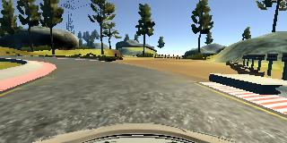
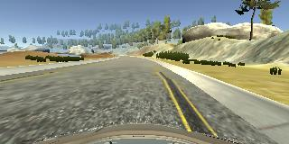
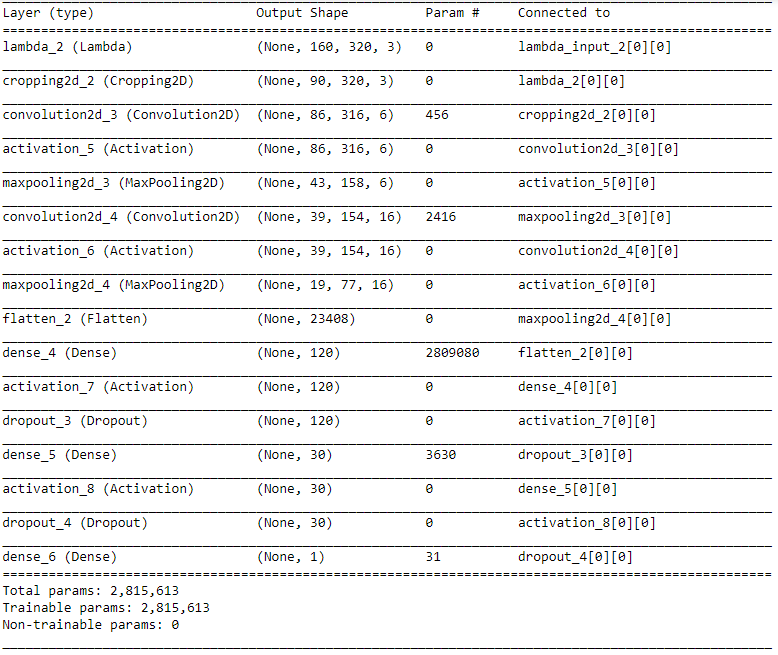
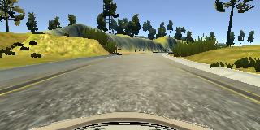
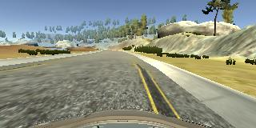
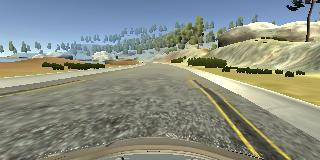
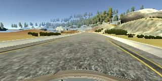
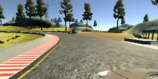
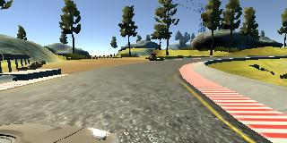

# **Behavioral Cloning** 

## Writeup

---

**Behavioral Cloning Project**

The goals / steps of this project are the following:
* Use the simulator to collect data of good driving behavior
* Build a convolution neural network in Keras that predicts steering angles from images
* Train and validate the model with a training and validation set
* Test that the model successfully drives around track one without leaving the road
* Summarize the results with a written report

## Rubric Points
### Here I will consider the [rubric points](https://review.udacity.com/#!/rubrics/432/view) individually and describe how I addressed each point in my implementation.  

---
### Files Submitted & Code Quality

#### 1. Submission includes all required files and can be used to run the simulator in autonomous mode

My project includes the following files:
* model.py containing the script to create and train the model
* drive.py for driving the car in autonomous mode
* model.h5 containing a trained convolution neural network 
* writeup_report.md summarizing the results
* video.mp4 containing the recording of the vehicle driving autonomously for one lap around the track.

#### 2. Submission includes functional code
Using the Udacity provided simulator and my drive.py file, the car can be driven autonomously around the track by executing 
```
python drive.py model.h5
```

#### 3. Submission code is usable and readable

The model.py file contains the code for training and saving the convolution neural network. The file shows the pipeline I used for training and validating the model, and it contains comments to explain how the code works.

### Model Architecture and Training Strategy

#### 1. An appropriate model architecture has been employed

My model consists of two convolution neural networks with 5x5 filter sizes and depths of 6 and 16 each (model.py lines 93-97). The model also has three fully connected layers after the convolutional network layes.

The model includes RELU layers to introduce nonlinearity (code line 94,98,104,108), and the data is normalized in the model using a Keras lambda layer (code line 87). The model also crops the images using the Keras Cropping 2D layer (code line 90).

#### 2. Attempts to reduce overfitting in the model

The model contains dropout layers after the first two fully connected layers in order to reduce overfitting (model.py lines 105,109). By using the dropout layers, the validation loss was decreased and came close to the training loss than before the dropout was used.

The model was trained and validated on different data sets to ensure that the model was not overfitting (code line 20). The model was tested by running it through the simulator and ensuring that the vehicle could stay on the track.

#### 3. Model parameter tuning

The model used an adam optimizer, so the learning rate was not tuned manually (model.py line 114).

#### 4. Appropriate training data

Training data was chosen to keep the vehicle driving on the road. I used a combination of center lane driving, recovering from the left and right sides of the road and includes the recovery from the edges of the curves back to the center of the road. 




For details about how I created the training data, see the next section. 

### Model Architecture and Training Strategy

#### 1. Solution Design Approach

The overall strategy for deriving a model architecture was to make the car drive autonomously in the track without it going out of the drivable area. The model was derived by minimizing the loss as much as possible for achieving this.

In order to gauge how well the model was working, I split my image and steering angle data into a training and validation set. Also, I selected mean squared error as the loss function, since this problem is of regression type.

My first step was to use a simple network with a single convolutional network and two dense layers. This resulted in a high testing and validation loss. Also, the car in autonomous mode kept going out of the road in the beginning itself. Inorder to reduce the loss further to a minimal value, I added one more convolutional layer and a fully connected layer to the model. This resulted in a low loss value on the training data set but a high loss value on the validation data set. This implied that the model was overfitting. I added dropout layers with a keep_prob of 50% to the first two dense layers. This helped to mitigate overfitting and the validation loss came to a very low value.

The final step was to run the simulator to see how well the car was driving around track one. The car ran pretty well in the straight road but was having more bias to turn left and then recover. This was due to the fact that the track used for training the car had more left curves than the right. Inorder to solve this, I augmented the data. I used techniques of flipping the images and using the data from the left and right camera images. The validation loss decreased further after this.

At the end of the process, the vehicle is able to drive autonomously around the track without leaving the road.

#### 2. Final Model Architecture

My model consists of two convolutional neural network layers followed by three fully connected layers.

The data is normalized in the beginning of the model using a Keras lambda layer (model.py line 87) and is cropped using the Keras Cropping2D layer. The cropping is done so that only the part of the image which contains the road is taken for training and it helped in speeding up the training process as well.

```python
#Normalising the data
model.add(Lambda(lambda x: (x /255)-0.5,input_shape=(160,320,3)))

#Cropping unwanted pixels off the images
model.add(Cropping2D(cropping=((50,20),(0,0))))
```

The convolution neural networks have 5x5 filter sizes and depths of 6 and 16 respectively in each layer (code lines 93-97).

The output from the convolutional layers are flattened and are passed on to the three fully connected layers. The final output of these fully connected layers predicts the final steering angle.

The model also includes RELU layers  after the first four layers to introduce nonlinearity (code line 94,98,104,108).

The below table shows the summary of the model used.


#### 3. Creation of the Training Set & Training Process

To capture good driving behavior, I first recorded a lap on track one using center lane driving. Here is an example image of center lane driving:



I then recorded the vehicle recovering from the left side and right sides of the road back to center so that the vehicle would learn to recover back to the center. The below images show what a recovery looks like.





The data set was randomly shuffled and 20% of the data was put aside for the validation set. 

To augment the data sat, I flipped images and angles. This was done because the track had more left turns than right curves. The images from the left and right cameras were taken and these were flipped. A correction value of 0.25 was added for the angles from the left image and was subtracted for the angles for the right image. This method helped in balancing the dataset. For example, here is an image that has then been flipped:




A python generator was used for passing the images to the network for training. The augmentation was done on the images in each batch. The above steps created 40640 number of data points.

The data is normalised by the model and is cropped using Keras layers. The cropping was done so that only the information related to the road were used by the neural network to train. This data was used to train the model.

The validation set helped determine if the model was over or under fitting. The ideal number of epochs was around 30 as the loss kept on decreasing after that. I used the Keras callback utilities, the EarlyStopping and the ModelCheckpoint, so that the best model was saved and the training was stopped if no improvement was found in the next 5 epochs. I used an Adam optimizer so that manually training the learning rate wasn't necessary.
